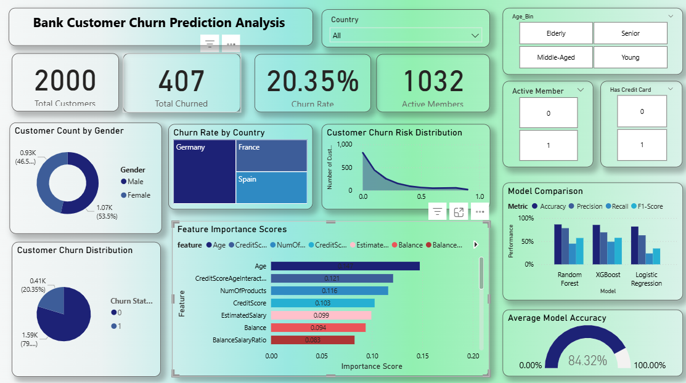

# 🚨 Bank Customer Churn Prediction System  

This project was developed as part of my **Machine Learning Internship with Future Interns**.  
The objective was to build a **Churn Prediction System** that identifies customers who are likely to stop using banking services, enabling businesses to focus on **customer retention strategies**.  

---

## 📌 Project Overview  
- Explored and cleaned the **Bank Customer Churn dataset**.  
- Performed **feature engineering** (e.g., Age Binning, Balance-to-Salary Ratio, CreditScore–Age Interaction).  
- Trained and evaluated **Logistic Regression, Random Forest, and XGBoost** models.  
- Compared models using **Accuracy, Precision, Recall, F1-Score, and ROC-AUC**.  
- Exported predictions and feature importance results to Power BI for business insights.  
- Designed an **interactive dashboard** to visualize churn risk and model performance.  

---

## 📂 Features  
✅ Predicts churn probability per customer  
✅ Feature importance scores for interpretability  
✅ Confusion matrix & churn distribution analysis  
✅ Interactive dashboard filters (country, age bins, active membership, credit card status)  
✅ Model comparison with accuracy, precision, recall, and F1-score metrics  

---

## 🛠️ Tech Stack  
- **Python** → Data preprocessing & ML model training  
- **Pandas, NumPy, Scikit-learn, XGBoost** → Data wrangling, feature engineering, model building  
- **Matplotlib & Seaborn** → Exploratory Data Analysis (EDA)  
- **Power BI** → Dashboard for visualization & storytelling  

---

## 📊 Dataset  
We used the **Bank Customer Churn Dataset** containing demographic, account, and service details of 10,000 customers.  

### Key Columns:  
- `Geography` → Country of customer  
- `Gender` → Male / Female  
- `Age` → Customer age  
- `CreditScore`, `Balance`, `Tenure`, `NumOfProducts`, `EstimatedSalary`  
- `IsActiveMember`, `HasCrCard` → Service-related features  
- `Exited` → Target variable (1 = churned, 0 = retained)  

📂 [Dataset – Kaggle](https://www.kaggle.com/datasets/adammaus/predicting-churn-for-bank-customers)  

---

## 🤖 Model Performance  

| Model               | Accuracy | Precision | Recall  | F1-Score | ROC-AUC |
|----------------------|----------|-----------|---------|----------|---------|
| Logistic Regression  | 0.8160   | 0.6275    | 0.2359  | 0.3429   | 0.7866  |
| Random Forest        | 0.8620   | 0.7811    | 0.4472  | 0.5688   | 0.8488  |
| XGBoost              | 0.8515   | 0.6910    | 0.4889  | 0.5727   | 0.8286  |

✅ **Random Forest** achieved the highest **accuracy (86.2%)**  
✅ **XGBoost** showed a stronger **recall (48.9%)** and balanced performance  
✅ Logistic Regression was the baseline model  

---

## 📈 Power BI Dashboard  
  

🔗 [Download the full Dashboard File](https://github.com/gkmr907/FUTURE_ML_02/blob/main/ML_Task_2.pbix)  

---

## 📌 How to Run  

### 1. Model Training (Python)  
- Run [`ml_task_2.py`](ml_task_2.py) for preprocessing, model training, and evaluation.  
- Outputs:  
  - `customer_churn_insights.csv` → Predictions & churn probabilities  
  - `feature_importance_random_forest.csv` / `feature_importance_xgboost.csv` → Feature importance  
  - `feature_importance_logistic_regression.csv` → Coefficients  

### 2. Power BI Dashboard  
- Open [`ML_Task_2.pbix`](ML_Task_2.pbix) in Power BI Desktop.  
- Refresh data connections (CSV exports from Python).  

---

## 📜 Conclusion  
This project demonstrates how **Machine Learning + Business Dashboards** can work together to:  
- Predict customer churn with high accuracy  
- Highlight the most important drivers of churn  
- Provide actionable insights for **retention strategies** in the banking sector  

🏆 This fulfills **Task 2 of my Machine Learning Internship with Future Interns**, focusing on **classification, predictive modeling, and business analytics**.  

## 📜 Conclusion  
This project demonstrates how **Machine Learning + Business Dashboards** can work together to:  
- Predict customer churn with high accuracy  
- Highlight the most important drivers of churn  
- Provide actionable insights for **retention strategies** in the banking sector  

🏆 This fulfills **Task 2 of my Machine Learning Internship with Future Interns**, focusing on **classification, predictive modeling, and business analytics**.  

